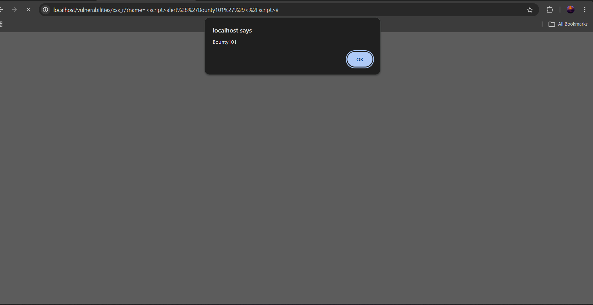
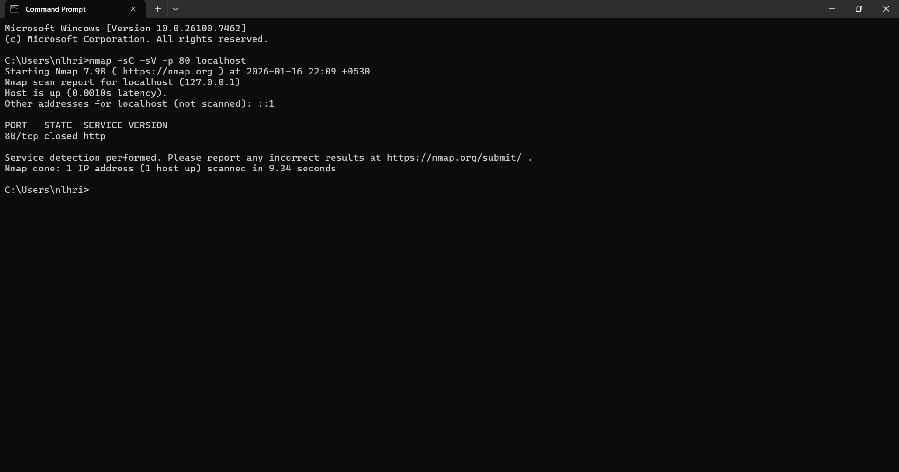

# Bounty Hunt 101: Web Vulnerability Assessment

**Project by:** Student
**Date:** 17 January 2026
**Target:** Localhost (DVWA - Damn Vulnerable Web App)

## 1. Executive Summary
This project simulates a bug bounty workflow, focusing on reconnaissance and the exploitation of common web vulnerabilities. Three critical vulnerabilities were identified: Reflected XSS, SQL Injection, and Command Injection. These flaws could allow attackers to steal user data, hijack sessions, or execute arbitrary code on the server.

---

## 2. Reconnaissance
**Tool Used:** Nmap
**Command:** `nmap -sC -sV -p 80 localhost`

**Findings:**
Service enumeration was performed on the localhost target to identify running web services. The scan confirms port 80 is active.

---

## 3. Vulnerability Findings

### 3.1 Reflected Cross-Site Scripting (XSS)
**Severity:** Medium
**Description:**
The application fails to sanitize user input in the "What's your name?" field. This allows an attacker to inject malicious JavaScript that executes in the victim's browser.
**Impact:**
- Session Hijacking (Cookie Theft)
- Phishing and Redirection

**Proof of Concept:**
Payload: ``

---

### 3.2 SQL Injection (SQLi)
**Severity:** High
**Description:**
The "User ID" input field is vulnerable to SQL Injection. By injecting the boolean condition `' OR '1'='1`, an attacker can bypass the query logic and retrieve the entire list of registered users.
**Impact:**
- Full Database Dump (Confidentiality Loss)
- Potential Authentication Bypass

**Proof of Concept:**
Payload: `' OR '1'='1`

---

### 3.3 Command Injection (RCE)
**Severity:** Critical
**Description:**
The "Ping a Device" feature takes a raw IP address and passes it to the system shell. By appending `&& cat /etc/passwd`, an attacker can execute arbitrary operating system commands.
**Impact:**
- Remote Code Execution (RCE)
- Full System Compromise

**Proof of Concept:**
Payload: `127.0.0.1 && cat /etc/passwd`

---

## 4. Remediation Strategy
To secure the application, the following actions are recommended:
1. **Input Validation:** Implement strict allow-lists for all user inputs.
2. **Prepared Statements:** Use parameterized queries to prevent SQL Injection.
3. **Output Encoding:** Encode special characters to neutralize XSS attacks.
4. **Disable System Calls:** Use language-specific libraries instead of executing shell commands.
